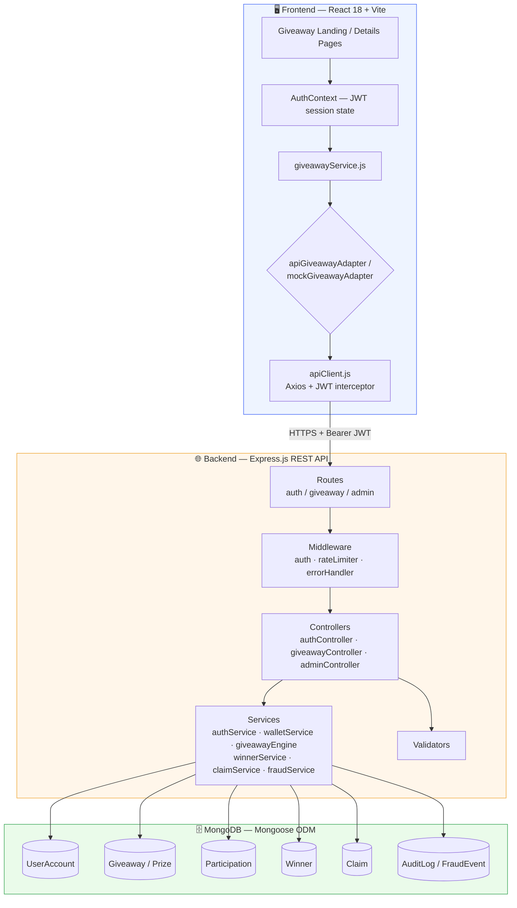
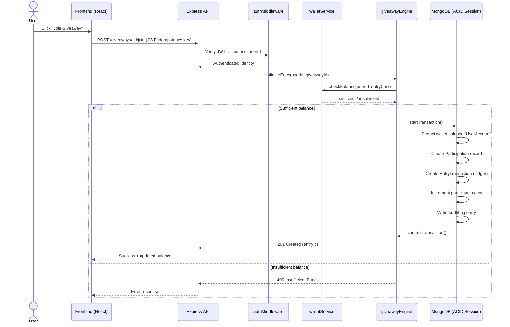
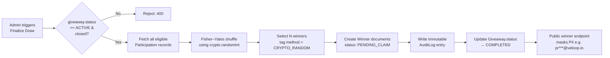
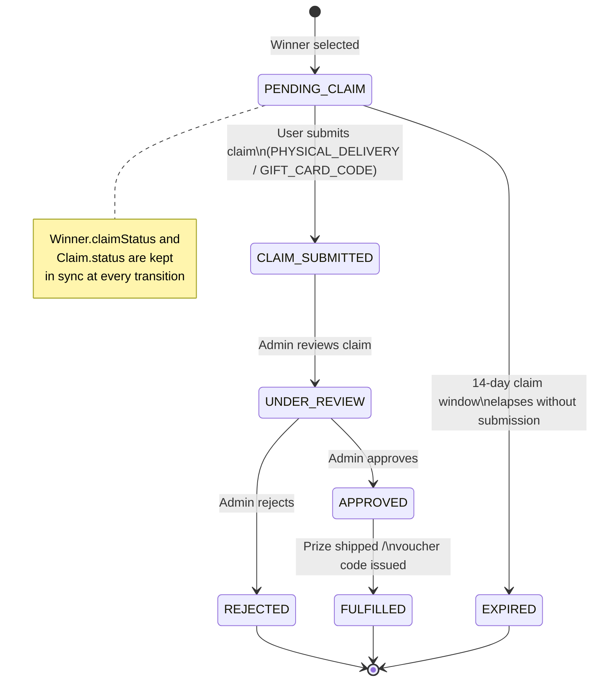
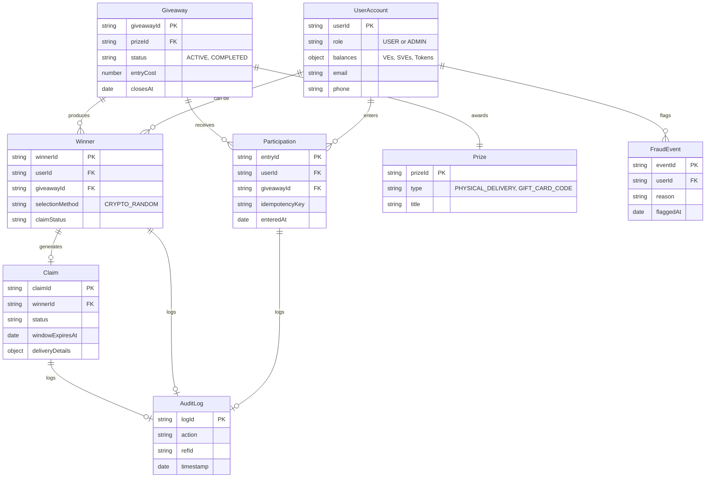

# 🎁 VELOOP Rewards – Giveaway System

A scalable, production-grade **Giveaway Platform** built for VELOOP Rewards. The platform empowers users to enter high-value prize draws (physical hardware, retail gift cards, and digital vouchers) using their accrued VELOOP balances (`VEs`, `SVEs`, and `Tokens`).

🔗 **Live Demo:** [veloop-assignment-sujal.vercel.app](https://veloop-assignment-sujal.vercel.app)
📘 **Live API Docs (Postman):** [documenter.getpostman.com](https://documenter.getpostman.com/view/39215245/2sBYAxQVSw)

---

## 📑 Table of Contents

1. [System Overview](#-system-overview)
2. [High-Level Architecture](#-high-level-architecture)
3. [Technology Stack](#-technology-stack)
4. [Core Workflows](#-core-workflows)
   - [Giveaway Participation Flow](#1-giveaway-participation-flow)
   - [Winner Finalization Flow](#2-winner-finalization-flow)
   - [Prize Claim Lifecycle](#3-prize-claim-lifecycle-state-machine)
5. [Data Model / Entity Relationships](#-data-model--entity-relationships)
6. [Project Structure](#-project-structure)
7. [Production Database Requirements](#-production-database-requirements--transactional-consistency)
8. [Security & Privacy Invariants](#-security--privacy-invariants)
9. [API & Postman Documentation](#-api--postman-documentation)
10. [Local Development & Setup](#-local-development--setup)
11. [Testing & Linting](#-testing--linting)
12. [License](#-license--notes)

---

## 🧩 System Overview

The system is structured into a modular, decoupled architecture with four functional pillars:

| Pillar | Description |
|---|---|
| **Frontend** | React 18 + Vite SPA with custom CSS Modules design tokens, accessible dialog modals, live countdown timers, public winner showcases, authenticated claim-lifecycle tracking, and fully responsive layouts. |
| **Backend** | Express.js REST API with Mongoose 8.x ODM, JWT authentication, role-based authorization (`USER` vs `ADMIN`), tiered rate limiting, Helmet security headers, and structured request validation. |
| **Participation & Ledger** | Authoritative wallet-balance deduction, UUID idempotency keys to prevent double-spend, and an immutable financial ledger for every transaction. |
| **Winner Finalization** | Admin-triggered CSPRNG winner-drawing engine (`crypto.randomInt` + Fisher–Yates shuffle, tagged `CRYPTO_RANDOM`), self-healing crash consistency, and append-only audit logs. |
| **Prize Claim Foundation** | Authenticated claim submission for `PHYSICAL_DELIVERY` and `GIFT_CARD_CODE` prizes, dual-status synchronization between `Winner.claimStatus` and `Claim.status`, a configurable 14-day claim window, and strict PII boundaries. |

---

## 🏗 High-Level Architecture



**Key design principles**

- **Decoupled layers** — controllers stay thin; all business/financial logic lives in the `services/` layer.
- **Adapter pattern on the frontend** — `giveawayService.js` can transparently swap between the real API adapter and a mock adapter, enabling offline/demo mode.
- **Server-derived identity** — the backend never trusts client-submitted user/winner/claim IDs; identity always comes from the verified JWT.

---

## 🧰 Technology Stack

### Frontend
- **Framework & Core:** React 18 (JavaScript/JSX), Vite
- **Routing:** React Router DOM v6
- **Styling:** Vanilla CSS Modules with a VELOOP design-token system (`--color-surface`, `--color-primary`, `--radius-*`, `--space-*`), Bootstrap 5 baseline
- **Icons:** Lucide React
- **HTTP Client:** Axios with an authenticated JWT request interceptor and a centralized error normalizer
- **Linting:** ESLint (Flat Config)

### Backend
- **Runtime:** Node.js (ES Modules)
- **Framework:** Express.js
- **Database & ODM:** MongoDB with Mongoose 8.x
- **Security & Headers:** Helmet, CORS, Express rate-limiting, CSPRNG randomness (`crypto.randomInt`)
- **Logging:** Morgan, plus structured `AuditLog` and `FraudEvent` models
- **Testing:** Node.js native test runner (`node --test`) — 68 integration tests across 12 suites
- **Linting:** ESLint

---

## 🔄 Core Workflows

### 1. Giveaway Participation Flow



### 2. Winner Finalization Flow



Self-healing note: if the process crashes mid-draw, reconciliation logic on the next read/retry checks `Giveaway.status` and partially-written `Winner` records to safely resume or roll forward without double-drawing winners.

### 3. Prize Claim Lifecycle (State Machine)



---

## 🗂 Data Model / Entity Relationships



---

## 📁 Project Structure

```
veloop-giveaway/
│
├── frontend/
│   ├── public/
│   ├── src/
│   │   ├── assets/                 # Official VELOOP prize assets & logos
│   │   ├── components/
│   │   │   ├── common/             # Header, Footer, VeloopLoader
│   │   │   └── giveaway/           # GiveawayCard, JoinModal, PrizeClaimModal, WinnerTabs
│   │   ├── context/                # AuthContext (JWT session & profile state)
│   │   ├── data/                   # Constants, enums, isolated mock fallback
│   │   ├── pages/
│   │   │   ├── Giveaway/           # Landing page with active pools & winner sliders
│   │   │   ├── GiveawayDetails/    # Showcase, winner celebration, claim tracker, specs
│   │   │   └── NotFound/           # 404 page
│   │   ├── routes/                 # AppRoutes registry
│   │   ├── services/
│   │   │   ├── adapters/           # apiGiveawayAdapter & mockGiveawayAdapter
│   │   │   ├── apiClient.js        # Axios instance with Bearer interceptor
│   │   │   └── giveawayService.js  # Unified service interface
│   │   ├── styles/                 # Design tokens & global CSS
│   │   └── utils/                  # Currency formatting, user identity masking
│   ├── package.json
│   └── vite.config.js
│
├── backend/
│   ├── src/
│   │   ├── config/                 # db.js, env.js
│   │   ├── controllers/            # adminController, authController, giveawayController
│   │   ├── middleware/              # authMiddleware, errorHandler, rateLimiter
│   │   ├── models/                 # UserAccount, Giveaway, Prize, Participation, Winner, Claim, AuditLog, FraudEvent
│   │   ├── routes/                 # adminRoutes, authRoutes, giveawayRoutes, index.js
│   │   ├── scripts/                # seed.js (Demo personas & test giveaways)
│   │   ├── services/                # authService, claimService, fraudService, giveawayEngine, walletService, winnerService
│   │   ├── utils/                   # responseHelper.js
│   │   ├── validators/              # giveawayValidator.js
│   │   ├── app.js                   # Express application setup
│   │   └── server.js                # HTTP bootstrap & graceful shutdown
│   ├── tests/
│   │   └── integration.test.js     # 68 comprehensive backend integration tests
│   ├── package.json
│   └── .env.example
│
├── docs/
│   ├── architecture/
│   │   └── overview.md             # Complete architecture, state machines, and invariants
│   ├── api/
│   │   └── endpoints.md            # REST API reference and request/response schemas
│   ├── postman/                    # Postman collection + environment
│   └── screenshots/
│
├── README.md
└── package.json
```

---

## 🛢 Production Database Requirements & Transactional Consistency

> **Production Requirement: MongoDB Replica-Set or Sharded Cluster**

A **Replica-Set or Sharded MongoDB cluster is strictly required in production** for all giveaway financial and claim operations. Multi-document ACID transactions (`session.startTransaction()`) guarantee all-or-nothing atomicity across:

1. Wallet balance deduction (`UserAccount.balances`)
2. Participation record creation (`GiveawayParticipation`)
3. Financial entry transaction ledger creation (`EntryTransaction`)
4. Participant count increments and immutable audit logging (`AuditLog`)
5. Winner finalization and prize claim state updates (`Claim`, `Winner`)

**Standalone MongoDB (local dev / offline testing only):** supported exclusively via conditional atomic single-document updates and self-healing status reconciliation. It does **not** provide equivalent multi-document ACID crash safety — if the process is killed mid-write, reconciliation logic corrects state on the next read/retry, but true atomic consistency requires a replica set.

---

## 🔐 Security & Privacy Invariants

1. **Identity Authority** — the backend derives user identity strictly from the verified JWT session (`req.user.userId`). Client-supplied `userId`, `winnerId`, `claimId`, `prizeId`, `claimType`, or fee amounts in request bodies/query params are stripped.
2. **Cryptographic Randomness** — winner selection uses Node.js CSPRNG (`crypto.randomInt`) with Fisher–Yates shuffling, recorded as `CRYPTO_RANDOM`.
3. **Privacy Boundaries** — public winner endpoints mask identifiers (`pr***@veloop.io`). Raw PII (`phone`, `addressLine1`, `email`) is never exposed publicly, never stored in browser storage, and never logged in `AuditLog`/`FraudEvent` metadata.
4. **Rate Limiting & Anti-Abuse** — tiered Express rate limiting guards against automated bots, excessive join velocity, and admin-endpoint brute-forcing.

---

## 📡 API & Postman Documentation

| Resource | Link / Path |
|---|---|
| Live Interactive Postman Docs | [documenter.getpostman.com](https://documenter.getpostman.com/view/39215245/2sBYAxQVSw) |
| Importable Postman Collection (v2.1) | `docs/postman/VELOOP-Rewards-API.postman_collection.json` |
| Postman Environment | `docs/postman/VELOOP-Rewards-Environment.postman_environment.json` |
| Postman Guide & Integration Reference | `docs/api/postman-guide.md` |
| REST Endpoints & Schemas Reference | `docs/api/endpoints.md` |

---

## 🚀 Local Development & Setup

### 1. Prerequisites
- Node.js >= 18.0.0
- npm >= 9.0.0
- MongoDB instance running on `localhost:27017`

### 2. Installation
```bash
# From the repository root
npm run install:all
```

### 3. Environment Configuration
```bash
# Backend configuration
cp backend/.env.example backend/.env

# Frontend configuration
cp frontend/.env.example frontend/.env
```

### 4. Seed Demo Data
```bash
cd backend
node src/scripts/seed.js
```

### 5. Run Development Servers
```bash
# Start Backend (Port 5000)
cd backend
npm start

# Start Frontend (Port 5173, separate terminal)
cd frontend
npm run dev
```

---

## ✅ Testing & Linting

```bash
# Run backend integration tests (68 tests across 12 suites)
cd backend
npm test

# Run backend ESLint
npm run lint

# Run frontend ESLint & production build
cd frontend
npm run lint
npm run build
```

---

## 📄 License / Notes

Confidential & Proprietary – VELOOP Rewards. Developed for technical assessment and production implementation.
