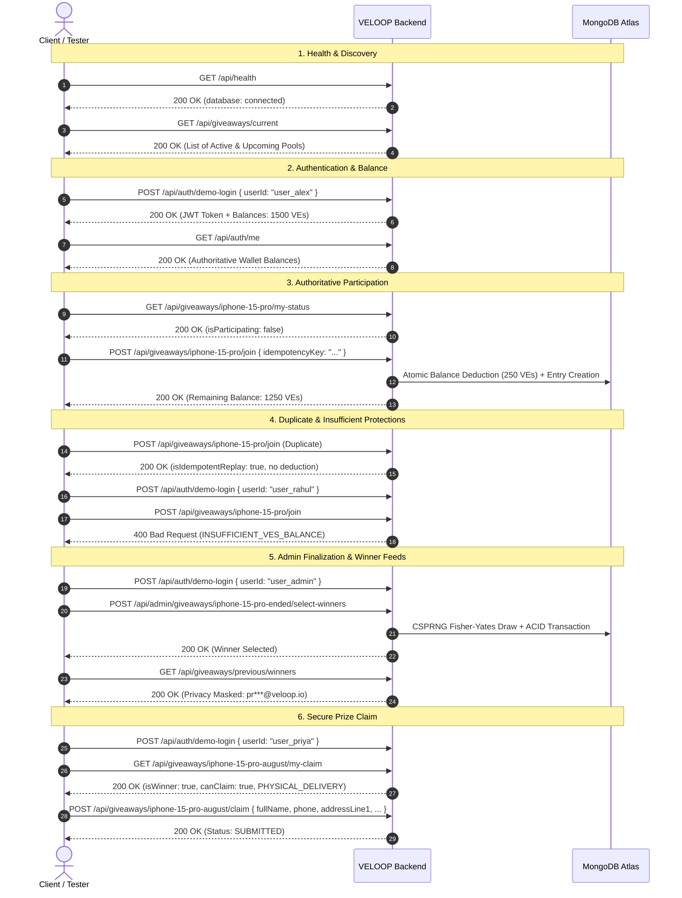

# VELOOP Rewards API — Postman Guide & Integration Reference

This document provides a comprehensive guide for importing, configuring, and executing the official **VELOOP Rewards Postman Collection** and **Environment**.

---

## 1. Documentation & File Locations

| Resource | Purpose | Link / Location |
|---|---|---|
| **Live Interactive Web Documentation** | Public Postman Documenter API reference & testing UI | [https://documenter.getpostman.com/view/39215245/2sBYAxQVSw](https://documenter.getpostman.com/view/39215245/2sBYAxQVSw) |
| **Postman Collection (v2.1)** | All 26 requests with documentation, parameters, and responses | [`docs/postman/VELOOP-Rewards-API.postman_collection.json`](file:///e:/VELoop%20Assignment/docs/postman/VELOOP-Rewards-API.postman_collection.json) |
| **Postman Environment** | Dynamic variables for base URL, tokens, slugs, and IDs | [`docs/postman/VELOOP-Rewards-Environment.postman_environment.json`](file:///e:/VELoop%20Assignment/docs/postman/VELOOP-Rewards-Environment.postman_environment.json) |

---

## 2. Quick Import Instructions

### Step 1: Open Postman
Open your Postman Desktop Application or Web Client.

### Step 2: Import Files
1. Click the **Import** button in the top-left corner.
2. Select **Files** or drag and drop:
   - `docs/postman/VELOOP-Rewards-API.postman_collection.json`
   - `docs/postman/VELOOP-Rewards-Environment.postman_environment.json`
3. Click **Import**.

### Step 3: Select the Environment
In the top-right environment selector dropdown, select:
> **`VELOOP Rewards Environment`**

---

## 3. Environment Variables

The environment is pre-configured with default values for local development and production testing:

| Variable | Default Value | Description |
|---|---|---|
| `baseUrl` | `https://veloop-giveaway-api.onrender.com/api` | API Base URL (Change to `http://localhost:5000/api` for local testing) |
| `accessToken` | *(Dynamically populated on login)* | Active session Bearer JWT token |
| `adminToken` | *(Dynamically populated)* | Admin session Bearer JWT |
| `alexToken` | *(Dynamically populated)* | Alex (VIP Tier 2) session JWT |
| `priyaToken` | *(Dynamically populated)* | Priya (Winner Tier 1) session JWT |
| `rahulToken` | *(Dynamically populated)* | Rahul (Tier 0) session JWT |
| `giveawaySlug` | `iphone-15-pro` | Active featured giveaway slug |
| `giveawayId` | `6aa03c683b53d78fb9cd1fde` | Active giveaway ObjectId |
| `endedGiveawaySlug` | `iphone-15-pro-ended` | Ended pool awaiting admin finalization |
| `completedGiveawaySlug` | `iphone-15-pro-august` | Concluded pool with Priya as winner |
| `completedGiftCardSlug` | `amazon-gift-card-august` | Concluded pool with Alex as winner |
| `idempotencyKey` | `postman-demo-idempotency-001` | Sample idempotency key for joins |

> [!NOTE]
> **Zero Secrets Tracked:** No database passwords, JWT signing secrets, or connection strings are present in the Postman collection or environment. All credentials remain secure.

---

## 4. Pre-Seeded Demo Accounts

The database includes 4 official demo personas for end-to-end verification:

| User ID | Handle | Role | VIP Tier | Balances | KYC Verified? | Typical Scenario |
|---|---|---|---|---|---|---|
| `user_admin` | `admin_ops` | `ADMIN` | Tier 3 | 10,000 VEs / 5,000 SVEs / 25,000 Tokens | Yes | Finalizing winner draws via `/api/admin` |
| `user_alex` | `alex_vip` | `USER` | Tier 2 (VIP) | 1,500 VEs / 1,000 SVEs / 5,000 Tokens | Yes | Standard join, digital gift card claims |
| `user_priya` | `priya_m` | `USER` | Tier 1 | 350 VEs / 100 SVEs / 2,500 Tokens | Yes | Physical delivery prize claim verification |
| `user_rahul` | `rahul_k` | `USER` | Tier 0 | 50 VEs / 0 SVEs / 200 Tokens | No | Insufficient balance & KYC gate tests |

---

## 5. Automated Authentication Workflow

Every login request under `02 - Authentication` contains an automated Postman test script:

```javascript
pm.test("Status code is 200", function () {
    pm.response.to.have.status(200);
});
pm.test("Save JWT token to environment", function () {
    var jsonData = pm.response.json();
    pm.expect(jsonData.success).to.be.true;
    pm.environment.set("accessToken", jsonData.data.token);
});
```

When you execute any **Demo Login** request, the returned JWT is automatically assigned to `{{accessToken}}`. All subsequent authenticated requests in folders `04 - Participation`, `06 - Prize Claims`, and `07 - Admin` automatically include:

```http
Authorization: Bearer {{accessToken}}
```

---

## 6. End-to-End Recommended Demo Flow



---

## 7. Collection Structure & Requests Overview

### `01 - Health`
- **Health Check** (`GET /api/health`): Validates server uptime and database connection.

### `02 - Authentication`
- **Demo Login - Alex** (`POST /api/auth/demo-login`): Log in as VIP Tier 2.
- **Demo Login - Priya** (`POST /api/auth/demo-login`): Log in as Tier 1 Winner.
- **Demo Login - Rahul** (`POST /api/auth/demo-login`): Log in as Tier 0 Low Balance.
- **Demo Login - Admin** (`POST /api/auth/demo-login`): Log in as Operations Admin.
- **Get Current User Profile & Balances** (`GET /api/auth/me`): Queries live wallet balances.
- **List Demo Users (Development Only)** (`GET /api/auth/users`): Lists test personas (returns 404 in production).

### `03 - Giveaway Discovery`
- **Get Current Giveaways** (`GET /api/giveaways/current`): Active pools.
- **Get Previous Giveaways** (`GET /api/giveaways/previous`): Concluded pools.
- **Get Platform Stats** (`GET /api/giveaways/stats`): Summary metrics.
- **Get Giveaway Details by Slug** (`GET /api/giveaways/:slug`): Detailed pool specs and rules.

### `04 - Participation`
- **Get My Participation Status** (`GET /api/giveaways/:slug/my-status`): User entry check.
- **Join Giveaway - Alex** (`POST /api/giveaways/:slug/join`): Authoritative 250 VEs deduction.
- **Join Giveaway - Duplicate Join Attempt** (`POST /api/giveaways/:slug/join`): Idempotency test.
- **Join Giveaway - Insufficient Balance (Rahul)** (`POST /api/giveaways/:slug/join`): Rejection test.

### `05 - Winners`
- **Get Giveaway Winners by Pool** (`GET /api/giveaways/:slug/winners`): Masked pool winners.
- **Get Previous Concluded Winners** (`GET /api/giveaways/previous/winners`): Historical verified winners.
- **Get All Platform Winners** (`GET /api/giveaways/winners`): Platform winner roster.

### `06 - Prize Claims`
- **Get My Claim Status (Priya)** (`GET /api/giveaways/:slug/my-claim`): Unclaimed physical prize status.
- **Submit Physical Prize Claim (Priya)** (`POST /api/giveaways/:slug/claim`): Shipping address form submission.
- **Submit Digital Gift Card Claim (Alex)** (`POST /api/giveaways/:slug/claim`): Voucher delivery email submission.
- **Submit Duplicate Claim** (`POST /api/giveaways/:slug/claim`): Replay protection test.
- **Submit Claim - Non-Winner Attempt (Rahul)** (`POST /api/giveaways/:slug/claim`): HTTP 403 authorization check.

### `07 - Admin Operations`
- **Finalize Giveaway Winners** (`POST /api/admin/giveaways/:slug/select-winners`): Admin CSPRNG draw.
- **Finalize Winners - Unauthorized User (Alex)** (`POST /api/admin/giveaways/:slug/select-winners`): HTTP 403 test.
- **Finalize Winners - Unauthenticated** (`POST /api/admin/giveaways/:slug/select-winners`): HTTP 401 test.

---

## 8. Security & Technical Assurances

1. **Backend Authority**: Client requests cannot specify `userId`, `amount`, `currency`, `prizeId`, or `claimType`. All financial amounts and prize categories originate strictly from the backend database.
2. **Cryptographic Randomness (CSPRNG)**: Winner selection utilizes Node.js `crypto.randomInt` inside an in-place Fisher-Yates shuffle. No pseudo-random `Math.random()` is used.
3. **Transaction Safety**: Multi-document ACID transactions guarantee all-or-nothing atomicity across `Claim`, `Winner`, `UserAccount`, and `AuditLog` on MongoDB Replica Sets.
4. **Zero Client Secrets**: The Postman environment does not contain JWT secrets, database connection URIs, or system passwords.
